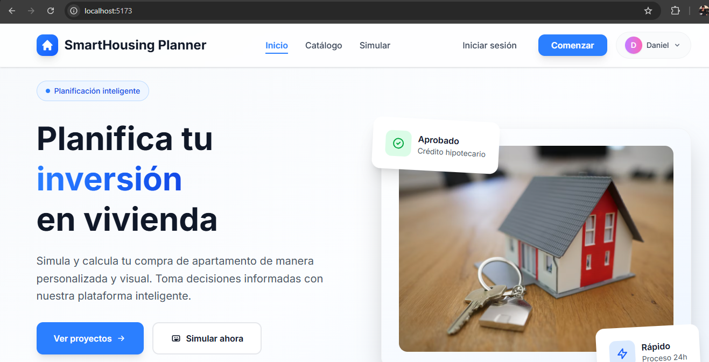
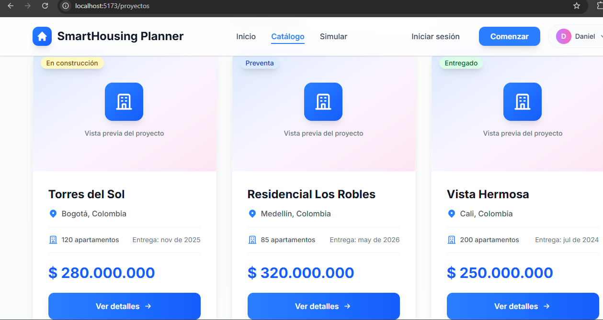
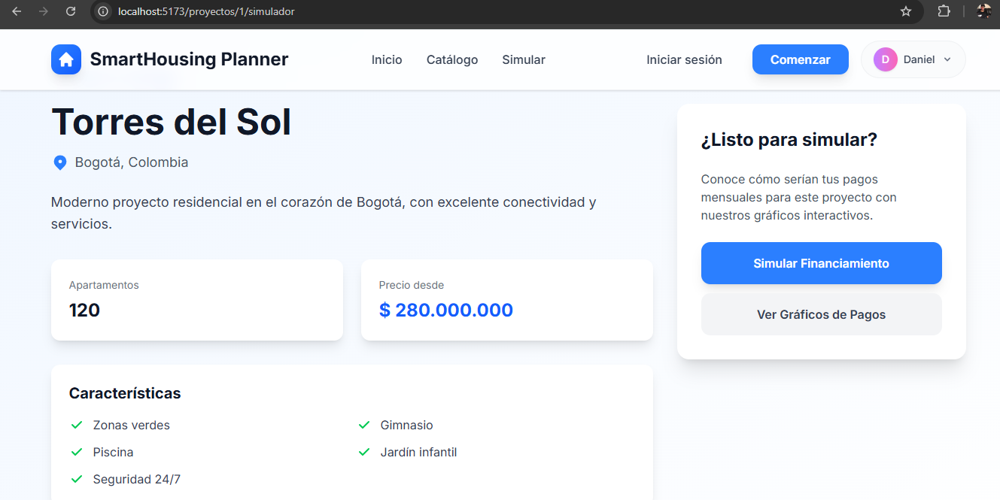
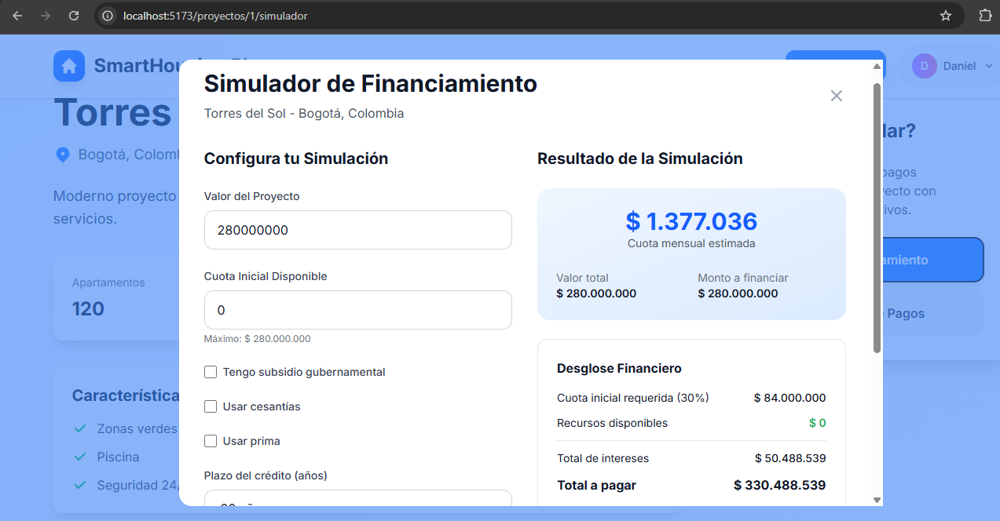
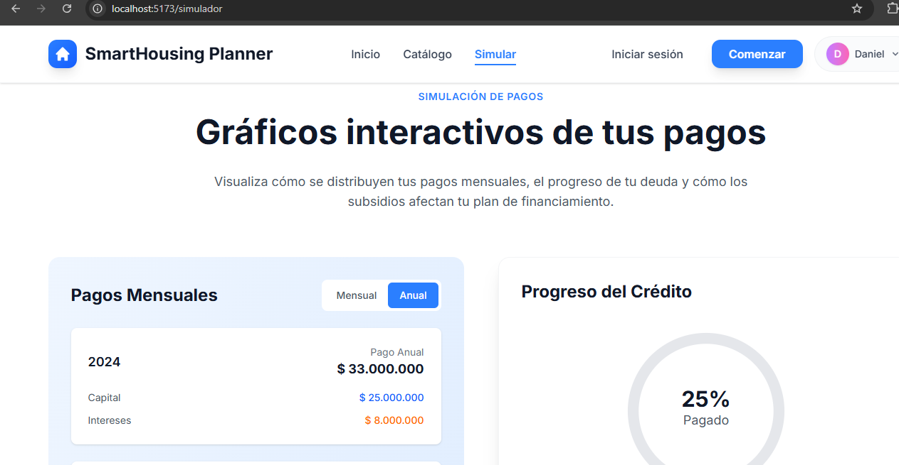
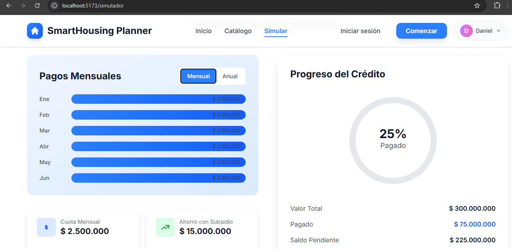
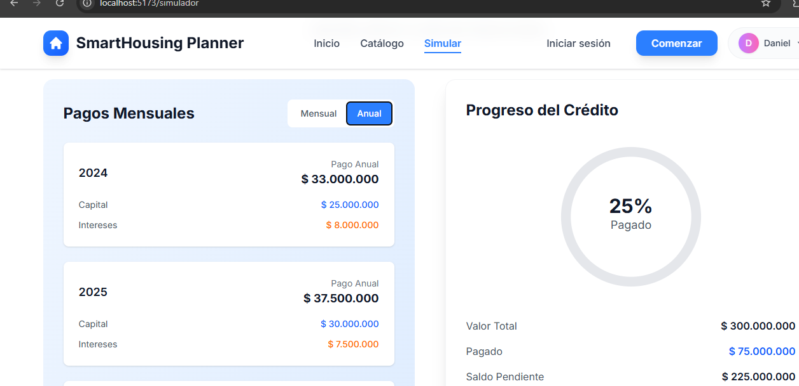

# Asignatura: Electiva 1

# Integrantes del proyecto

Daniel Felipe Martin Bedoya
Sebastian Vergara Mosquera

# Smart Housing Planner

Aplicación web para simular y gestionar el financiamiento de proyectos inmobiliarios.

SmartHousing Planner es una plataforma web interactiva desarrollada en React que permite a los usuarios simular la compra de un apartamento,calcular planes de pago personalizados, aplicar subsidios y visualizar resultados financieros mediante gráficas dinámicas y fáciles de entender.

# Objetivo

Brindar a los usuarios una herramienta digital que les permita planificar y entender de forma clara su
inversión en vivienda, facilitando la toma de decisiones informadas mediante simulaciones visuales y
comparativas de pago.

## Funcionalidades

- **Catálogo de proyectos**: Explorar proyectos habitacionales disponibles
- **Simulador de crédito**: Calcular cuotas y financiamiento con subsidios, cesantías y primas
- **Gestión de pagos**: Visualizar el estado de pagos hipotecarios
- **Información gubernamental**: Consultar subsidios y pasos para compra de vivienda

# Instruccion de ejecución.

1. Abre la terminal en VS Code
2. Instala las dependencias dentro de la carpeta del proyecto: npm install
3. Inicia el servidor de desarrollo: npm run dev
4. En caso de algun error por el paquete @tailwindcss/vite
ejecuta --npm install -D @tailwindcss/vite-- y luego el paso 3.

## Tecnologías

- React + Vite
- Tailwind CSS
- React Router
- SweetAlert2

# Inicio (Navbar).

# Boton ver proyecto del inicio, nos direcciona a los proyectos o catalogo (navbar).

# Boton ver detalle dentro de cada proyecto, nos direcciona a la informacion del proyecto y hacer la simulacion. 

# Boton simulador financiamiento, nos lleva al formulario para la simulacion.

# Simulador (Navbar).

# Boton mensual dentro de simular nos muestra los pagos mensuales.

# Boton anual dentro de simular nos muestra los pagos anuelaes.

